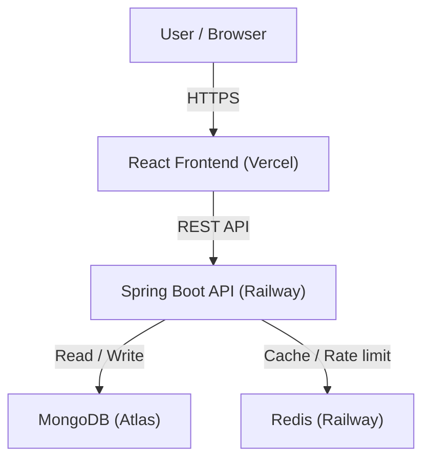

# Kutt-it

> A production-ready, full-stack URL shortener with analytics, QR codes, and link management.

[](https://kutt-it-tau.vercel.app)
[](https://spring.io/projects/spring-boot)
[](https://react.dev)


## Overview

Kutt-it converts long URLs into short, shareable links. It ships with a dashboard for managing links, per-link click analytics, QR code generation, expiry dates, tagging, and rate limiting — all backed by a RESTful Spring Boot API and a React frontend.


## Features

| Feature | Details |
|---------|---------|
| URL Shortening | Auto-generated base62 codes or custom aliases |
| Link Management | Create, edit, soft-delete with full audit trail |
| Click Analytics | Total clicks + per-day chart |
| QR Codes | Generated on demand, downloadable as PNG |
| Expiry Dates | Links auto-expire; expired aliases are reusable |
| Tags | Organize and filter links by tag |
| Bulk Shorten | Up to 120 URLs per request via API |
| Authentication | JWT-based with BCrypt password hashing |
| Rate Limiting | 120 req/hr (authenticated), 10 req/hr (anonymous) |
| Caching | Redis-backed redirect cache (12hr TTL) |
| Monitoring | Prometheus metrics via Spring Actuator |
| Dark Mode | System-aware theme toggle |


## Architecture




## Tech Stack

**Backend**
- Java 17, Spring Boot 3.3.5, Spring Security
- MongoDB (persistence), Redis (caching)
- JWT (jjwt), BCrypt, Bucket4j, ZXing
- Spring Actuator + Micrometer + Prometheus
- Docker, Docker Compose

**Frontend**
- React 18, Vite, Tailwind CSS
- TanStack Query v5, React Router v6
- Recharts, Axios


## Getting Started

### Prerequisites

| Tool | Version |
|------|---------|
| Java | 17+ |
| Maven | 3.6+ |
| Node.js | 20+ |
| Docker | 20.10+ _(optional)_ |

### Option A — Docker (Recommended)

```bash
git clone https://github.com/dev-ayush101/kutt-it.git
cd kutt-it
docker-compose up --build
```

| Service | URL |
|---------|-----|
| Backend | http://localhost:8080 |
| Frontend | http://localhost:5173 |
| Health | http://localhost:8080/actuator/health |

### Option B — Manual

```bash
# Terminal 1 — Backend (MongoDB + Redis must be running locally)
mvn spring-boot:run

# Terminal 2 — Frontend
cd frontend
cp .env.example .env
npm install
npm run dev
```


## Configuration

### Backend Environment Variables

| Variable | Description | Default |
|----------|-------------|---------|
| `SPRING_DATA_MONGODB_URI` | MongoDB connection string | `mongodb://localhost:27017/kuttit` |
| `SPRING_DATA_REDIS_HOST` | Redis host | `localhost` |
| `SPRING_DATA_REDIS_PORT` | Redis port | `6379` |
| `SPRING_DATA_REDIS_PASSWORD` | Redis password | _(empty)_ |
| `JWT_SECRET` | JWT signing key (min 32 chars) | dev default |
| `JWT_EXPIRATION` | Token lifetime in ms | `86400000` (24h) |
| `APP_BASE_URL` | Public URL of the backend | `http://localhost:8080` |
| `APP_CORS_ORIGIN` | Allowed frontend origin | `http://localhost:5173` |

### Frontend Environment Variables

| Variable | Description |
|----------|-------------|
| `VITE_API_BASE_URL` | Backend base URL (leave empty for local dev — Vite proxy handles it) |

See `frontend/.env.example` for a template.


## API Reference

### Authentication

| Method | Endpoint | Auth | Description |
|--------|----------|:----:|-------------|
| `POST` | `/api/auth/register` | — | Register a new user |
| `POST` | `/api/auth/login` | — | Login, returns JWT |

### Links

| Method | Endpoint | Auth | Description |
|--------|----------|:----:|-------------|
| `POST` | `/api/shorten` | Optional | Shorten a single URL |
| `POST` | `/api/shorten/bulk` | Required | Shorten up to 120 URLs |
| `GET` | `/api/r/{shortCode}` | — | Redirect to original URL |
| `GET` | `/api/user/links` | Required | List authenticated user's links |
| `PUT` | `/api/links/{shortCode}` | Required | Update URL, alias, or expiry |
| `DELETE` | `/api/links/{shortCode}` | Required | Soft-delete a link |
| `GET` | `/api/links/tags/{tag}` | Required | Filter links by tag |

### Analytics & QR

| Method | Endpoint | Auth | Description |
|--------|----------|:----:|-------------|
| `GET` | `/api/analytics/{shortCode}` | Owner only | Total clicks + clicks by date |
| `GET` | `/api/qr/{shortCode}` | Required | Generate and return QR code |

### Monitoring

| Method | Endpoint | Description |
|--------|----------|-------------|
| `GET` | `/actuator/health` | Health check |
| `GET` | `/actuator/prometheus` | Prometheus metrics |

### Example

```bash
curl -X POST https://kutt-it.up.railway.app/api/shorten \
  -H "Content-Type: application/json" \
  -H "Authorization: Bearer <token>" \
  -d '{"url": "https://example.com/very/long/path", "customAlias": "my-link", "tags": ["work"]}'
```

```json
{
  "shortCode": "my-link",
  "shortUrl": "https://kutt-it.up.railway.app/api/r/my-link"
}
```


## Deployment

### Backend → Railway

1. Connect the GitHub repo — Railway detects the `Dockerfile` automatically
2. Add a **Redis** database plugin
3. Set all backend environment variables in the Railway dashboard
4. Railway auto-deploys on every push to `main`

### Frontend → Vercel

1. Import the GitHub repo, set root directory to `frontend`
2. Set `VITE_API_BASE_URL` to your Railway backend URL
3. Set `APP_CORS_ORIGIN` in Railway to your Vercel URL
4. Vercel auto-deploys on every push to `main`


## Contributing

1. Fork the repository
2. Create a feature branch — `git checkout -b feature/your-feature`
3. Commit your changes with a descriptive message
4. Push and open a pull request